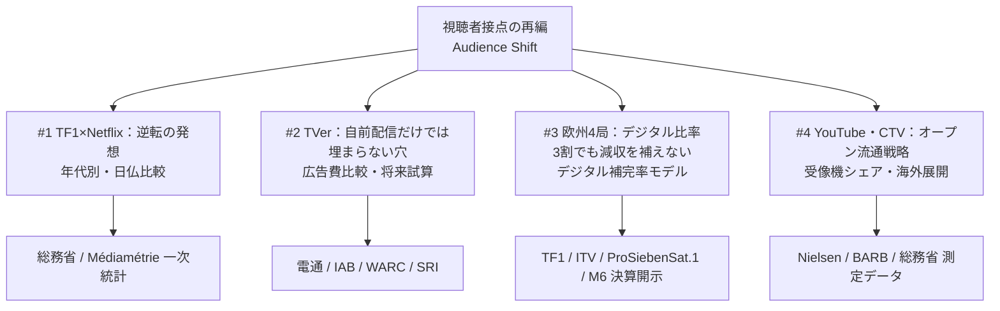

# Analytical Methodology & Definitions
## 放送事業者の視聴者接点再編：定量的推計ロジック・定義仕様書

本ドキュメントは、オープンデータ・BIアナリティクスダッシュボード『Broadcaster Audience Shift Dashboard』（Ver 1.10.0）において採用されているデータ定義、時系列比較手法、欧州放送局財務補完率、およびコネクテッドTV（CTV）シェアの測定・正規化ロジックに関する技術仕様書です。

---

## 1. 分析フレームワークと基本設計 (Analytical Framework)

本研究ダッシュボードは、テレビ放送局の視聴者接点（Audience Touchpoints）の構造変化を、主観や定性論を排し、日米欧の公的統計および上場放送事業者の一次決算データ（有価証券報告書・年次決算・Universal Registration Document）に基づき定量検証します。

---

## 2. 視聴行動転換モデル (Audience Behavior Transformation)

### 2.1 日仏世代別直接対比の同質セグメント正規化

日本（総務省 情報通信政策研究所「情報通信メディア利用時間調査」）とフランス（Médiamétrie「L'Année TV / Vidéo」）では、公表される年代区分の階層が異なります。本ダッシュボードでは、ライフステージの等価性に基づき、以下の同質セグメントに分類・整理して比較を行っています。

| セグメント区分 | 日本（総務省） | フランス（Médiamétrie） | 分析上の位置づけ |
|:---|:---|:---|:---|
| **若年層 (Youth)** | 10代（13〜19歳）および20代 | 15〜24歳 (Jeunes) | デジタルネイティブ層、視聴行動転換の先行指標 |
| **現役層 (Core Adults)** | 30代、40代、50代 | 25〜49歳 (Actifs) | 可処分所得・購買力の中心、広告主のコアターゲット |
| **シニア層 (Seniors)** | 60代（※70代は2024年新設） | 50歳以上 (50 ans et plus) | 従来型リニア放送の高ロイヤルティ・維持基盤 |

### 2.2 歴史的逆転年次の判定基準 (Crossover Formulation)

「平日1日あたりのリアルタイムテレビ視聴時間 $T_{\text{linear}}$」と「ネット動画利用時間 $T_{\text{net}}$」の逆転条件：

$$T_{\text{net}}(t) > T_{\text{linear}}(t)$$

* **日本10代**: 2018年（リアルタイム 73.3分 vs ネット 61.3分） $\rightarrow$ **2019年逆転**（リアルタイム 69.0分 vs ネット 84.9分）
* **日本20代**: 2019年（リアルタイム 98.4分 vs ネット 97.4分） $\rightarrow$ **2020年逆転**（リアルタイム 88.0分 vs ネット 146.8分）
* **フランス15–24歳**: 2017年までテレビ優位 $\rightarrow$ **2018年逆転**（非リニア動画がテレビ視聴時間を超過）

日仏間で若年層の逆転現象に約1〜2年のタイムラグが存在し、構造転換の普遍的な先行指標となっています。

---

## 3. 広告市場の構造転換と配信広告の規模比較 (Advertising Market Structure)

### 3.1 4カ国ネット逆転年次と倍率推移

各国の中央広告統計機関（英AA-WARC、仏SRI/UDECAM、米IAB/PwC、日電通）のデータに基づき、インターネット広告費 $A_{\text{net}}$ が地上波テレビ広告費 $A_{\text{tv}}$ を恒久的に上回った年次と同定：

$$\text{Ratio}(t) = \frac{A_{\text{net}}(t)}{A_{\text{tv}}(t)}$$

* **イギリス**: 2011年逆転（1.15倍） $\rightarrow$ 2025年現在 **7.76倍**（ネット £40.5bn / テレビ £5.22bn）
* **フランス**: 2016年逆転（1.05倍） $\rightarrow$ 2025年現在 **3.83倍**（ネット €12.40bn / テレビ €3.24bn）
* **アメリカ**: 2017年逆転（1.28倍） $\rightarrow$ 2025年現在 **4.27倍**（ネット $294.6bn / テレビ $69.0bn）
* **日本**: 2019年逆転（1.14倍） $\rightarrow$ 2025年現在 **2.30倍**（ネット 4兆0,459億円 / テレビ 1兆7,556億円）

### 3.2 日本のテレビ由来動画広告（TVer等）の市場規模

電通『日本の広告費』実績：
* 2025年 テレビメディア関連動画広告売上: **805億円**
* 総インターネット広告費（4兆0,459億円）に対するシェア: **1.99%**
* インターネットメディア広告費（3兆2,132億円）に対するシェア: **2.51%**
* 地上波テレビ広告費（1兆6,333億円）に対し、テレビ由来配信広告は約5%の規模にとどまる。

### 3.3 将来シミュレーションの考え方

地上波リニア広告の自然減収ペースに対し、自前配信アプリの増収のみで穴埋めを図るシナリオでは、市場全体の規模感から見て補完できる割合に構造的制約が存在することを定量的に検証しています。

---

## 4. 欧州主要4局 財務スコアカード＆デジタル補完率モデル (Financial Scorecard & Compensation)

欧州の大手商業放送局（Groupe TF1, ITV plc, ProSiebenSat.1 Media SE, Métropole Télévision M6）の公開決算資料に基づく財務分析モデルです。

### 4.1 デジタル売上比率 (Digital Revenue Share)
$$\text{Ratio}_{\text{digital}}(t) = \frac{\text{Revenue}_{\text{digital}}(t)}{\text{Revenue}_{\text{total\_media\_ad}}(t)} \times 100$$

* **ITV plc (英)**: 2025年 **31.3%**（ITVXの成長、デジタル売上 £474m / 放送広告 £1,514m）
* **ProSiebenSat.1 (独)**: 2025年 **16.3%**（JoynのAVODシフト、デジタル €354m / リニア €1,818m）
* **Groupe TF1 (仏)**: 2025年 **12.5%**（TF1+広告 €200m / リニア広告 €1,400m）
* **日本（民放キー局平均）**: 2025年 **4.4%**（TVer/SVOD合算 約805億円 / 地上波約1.75兆円）

### 4.2 デジタル補完率 (Digital Compensation Ratio)

リニア放送広告の減収額 $\vert \Delta \text{Rev}_{\text{linear}} \vert$ を、デジタル配信の増収額 $\Delta \text{Revenue}_{\text{digital}}$ がどれだけ補填できたかを測る評価指標：

$$R_{\text{comp}} = \frac{\Delta \text{Revenue}_{\text{digital}}}{\vert \Delta \text{Revenue}_{\text{linear}} \vert} = \frac{\text{Rev}_{\text{dig}}(2025) - \text{Rev}_{\text{dig}}(2019)}{\vert \text{Rev}_{\text{lin}}(2025) - \text{Rev}_{\text{lin}}(2019) \vert} \times 100 \, (\%)$$

$$\text{Net Impact} = \Delta \text{Revenue}_{\text{digital}} + \Delta \text{Revenue}_{\text{linear}}$$

* **ITV**: デジタル増収（+£260m）に対しリニア減収（-£320m） $\rightarrow$ 補完率 **81.3%**（純減 -£60m）
* **TF1**: デジタル増収（+€95m）に対しリニア減収（-€160m） $\rightarrow$ 補完率 **59.4%**（純減 -€65m）
* **ProSiebenSat.1**: デジタル増収（+€80m）に対しリニア減収（-€340m） $\rightarrow$ 補完率 **23.5%**（純減 -€260m）
* **M6**: デジタル増収（+€45m）に対しリニア減収（-€90m） $\rightarrow$ 補完率 **50.0%**（純減 -€45m）

**結論**: 欧州屈指のデジタル変革を遂げた英ITVでも補完率は約8割にとどまり、4局すべてで「Net Impact」はマイナスとなっており、自前配信の成長だけではリニア減収を完全には相殺できていない実態を示しています。

---

## 5. コネクテッドTV（CTV）大画面シェアの測定手法 (Connected TV Viewing Shares)

### 5.1 各国データソースの測定定義

コネクテッドTV（テレビ受像機の大画面）における各事業者のシェア測定は、公的・第三者パネル調査に基づいています。

1. **米国 (Nielsen: The Gauge)**:
   - 全米テレビ受像機における総視聴時間シェア。
   - 配信サービス（YouTube, Netflix, Prime Video等）のシェア動向。
2. **英国 (BARB: The Monthly Viewing Dashboard)**:
   - 全英テレビ受像機における分単位の視聴ログ。
   - 放送局オンデマンド（iPlayer, ITVX等）とグローバルプラットフォームの比較。
3. **日本 (総務省・調査各社)**:
   - 受像機のネット接続率およびCTV利用実態調査。

---

## 6. 免責事項・データ更新方針

* 本ダッシュボードで使用している為替レートは、比較年度のECB年間平均基準レート（2025年: 1 EUR = 0.85679 GBP = 1.1300 USD = 169.03 JPY）に基づいています。
* 各国の広告費データは算出基準が異なるため、単純な絶対額合算ではなく構造比率（倍率・シェア）としての対比を推奨します。
* 著作権・ライセンス: 本分析ロジックおよびダッシュボードソースコードは [MIT License](LICENSE) の下でオープンソースとして公開されています。
