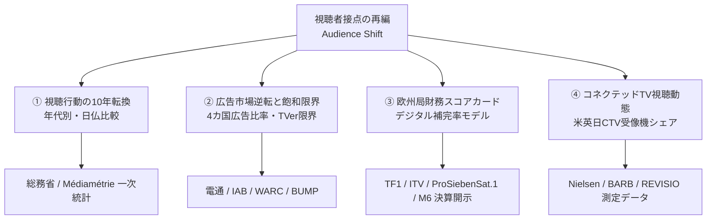
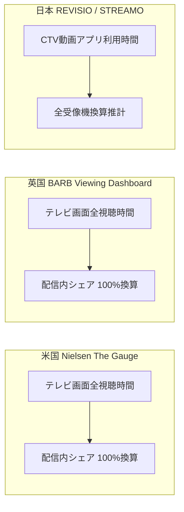

# Analytical Methodology & Mathematical Formulations
## 放送事業者の視聴者接点再編：定量的推計ロジック・数理モデル仕様書

本ドキュメントは、オープンデータ・BIアナリティクスダッシュボード『Broadcaster Audience Shift Dashboard』において採用されているデータ定義、時系列比較手法、広告飽和数理モデル、欧州放送局財務補完率、およびコネクテッドTV（CTV）シェアの測定・正規化ロジックに関する技術仕様書です。

---

## 1. 分析フレームワークと基本設計 (Analytical Framework)

本研究ダッシュボードは、テレビ放送局の視聴者接点（Audience Touchpoints）の解体と再編を、主観や定性論を排し、日米欧の公的統計および上場放送事業者の一次決算データ（有価証券報告書・年次決算・Universal Registration Document）に基づき定量検証します。



---

## 2. 視聴行動転換モデル (Audience Behavior Transformation)

### 2.1 日仏世代別直接対比の同質セグメント正規化

日本（総務省 情報通信政策研究所「情報通信メディア利用時間調査」）とフランス（Médiamétrie「L'Année TV / Vidéo」）では、公表される年代区分の階層が異なります。本ダッシュボードでは、ライフステージの等価性に基づき、以下の3大同質セグメントに分類・正規化して直接比較を行っています。

| セグメント区分 | 日本（総務省） | フランス（Médiamétrie） | 分析上の位置づけ |
|:---|:---|:---|:---|
| **若年層 (Youth)** | 10代（13〜19歳）および20代 | 15〜24歳 (Jeunes) | デジタルネイティブ層、視聴行動転換の先行指標 |
| **現役層 (Core Adults)** | 30代、40代、50代 | 25〜49歳 (Actifs) | 可処分所得・購買力の中心、広告主のコアターゲット |
| **シニア層 (Seniors)** | 60代（※70代は2024年新設のため除外） | 50歳以上 (50 ans et plus) | 従来型リニア放送の高ロイヤルティ・維持基盤 |

### 2.2 歴史的逆転年次の判定基準 (Crossover Formulation)

「平日1日あたりのリアルタイムテレビ視聴時間 $T_{\text{linear}}$」と「ネット動画利用時間 $T_{\text{net}}$」の逆転条件：

$$T_{\text{net}}(t) > T_{\text{linear}}(t)$$

* **日本10代**: 2018年（リアルタイム 73.3分 vs ネット 61.3分） $\rightarrow$ **2019年逆転**（リアルタイム 69.0分 vs ネット 84.9分）
* **日本20代**: 2019年（リアルタイム 98.4分 vs ネット 97.4分） $\rightarrow$ **2020年逆転**（リアルタイム 88.0分 vs ネット 146.8分）
* **フランス15–24歳**: 2017年までテレビ優位 $\rightarrow$ **2018年逆転**（非リニア・プラットフォーム動画がテレビ視聴時間を超過）

日仏間で若年層の逆転現象に約1〜2年のタイムラグが存在し、構造転換の普遍的な先行指標となっています。

---

## 3. 広告市場の構造転換と配信広告の飽和限界 (Advertising Saturation Model)

### 3.1 4カ国ネット逆転年次と倍率推移

各国の中央広告統計機関（英Ofcom/AA-WARC、仏SRI/UDECAM、米IAB/PwC、日電通）のデータに基づき、インターネット広告費 $A_{\text{net}}$ が地上波テレビ広告費 $A_{\text{tv}}$ を恒久的に上回った年次を同定：

$$\text{Ratio}(t) = \frac{A_{\text{net}}(t)}{A_{\text{tv}}(t)}$$

* **イギリス**: 2011年逆転（1.15倍） $\rightarrow$ 2025年現在 **7.76倍**（ネット £40.5bn / テレビ £5.22bn）
* **フランス**: 2016年逆転（1.05倍） $\rightarrow$ 2025年現在 **3.83倍**（ネット €12.40bn / テレビ €3.24bn）
* **アメリカ**: 2017年逆転（1.28倍） $\rightarrow$ 2025年現在 **4.27倍**（ネット $294.6bn / テレビ $69.0bn）
* **日本**: 2019年逆転（1.14倍） $\rightarrow$ 2025年現在 **2.30倍**（ネット 4兆0,459億円 / テレビ 1兆7,556億円）

### 3.2 放送局由来配信（BVOD/TVer）の市場シェア限界定理

インターネット広告市場において、放送局公式オンデマンド配信（BVOD: Broadcaster Video on Demand / 日本のTVer）が獲得可能なシェアには、検索連動型（Paid Search）、ソーシャルメディア広告（Social Display）、リテールメディア（Retail Media）の構造的優位により、厳格な「3〜4%の天井」が存在します。

$$\text{Share}_{\text{BVOD}}(t) = \frac{A_{\text{BVOD}}(t)}{A_{\text{net}}(t)} \le \kappa \quad (\kappa \approx 3.5\% \sim 4.0\%)$$

日本の2025年実績：
* テレビメディア関連動画広告売上: **805億円**
* 総インターネット広告費: **4兆0,459億円**
* シェア比率: **1.99%**（インターネットメディア広告費 3兆2,132億円分母では **2.51%**）

### 3.3 TVer広告売上のロジスティック普及数理モデル

将来（2025〜2035年）のTVer広告市場規模 $S(t)$ は、指数関数的成長ではなく、市場受容限界 $K$ を持つロジスティック普及曲線（S-Curve）に収斂します：

$$S(t) = \frac{K}{1 + A \cdot e^{-r(t - t_0)}}$$

* $K$: 市場受容容量パラメータ（飽和上限額 = 約1,500億円）
* $r$: 成長率パラメータ（$r \approx 0.28$）
* $t_0$: 成長転換点（変曲点 = 2023年）
* **結論**: 地上波広告の減収規模（年率数千億円規模）に対し、TVer単独の増収ポテンシャル（上限1,500億円、地上波全体の1割弱）では構造的相殺が不可能です。

---

## 4. 欧州主要4局 財務スコアカード＆デジタル補完率モデル (Financial Scorecard & Compensation)

欧州の大手商業放送局（Groupe TF1, ITV plc, ProSiebenSat.1 Media SE, Métropole Télévision M6）は、日本の民放キー局よりも5〜7年先行してリニア視聴の急減に直面し、大規模なBVOD/AVOD統合（TF1+, ITVX, Joyn, M6+）を断行しました。

### 4.1 デジタル売上比率 (Digital Revenue Share)
$$\text{Ratio}_{\text{digital}}(t) = \frac{\text{Revenue}_{\text{digital}}(t)}{\text{Revenue}_{\text{total\_media}}(t)} \times 100$$

* **ITV plc (英)**: 2025年 **31.3%**（ITVXの成長、デジタル売上 £474m / 放送広告 £1,514m）
* **ProSiebenSat.1 (独)**: 2025年 **16.3%**（JoynのAVODシフト、デジタル €354m / リニア €1,818m）
* **Groupe TF1 (仏)**: 2025年 **12.5%**（TF1+広告 €200m / リニア広告 €1,400m）
* **日本（民放キー局平均）**: 2025年 **4.4%**（TVer/SVOD合算 約805億円 / 地上波約1.75兆円）

### 4.2 デジタル補完率 (Digital Compensation Ratio)

リニア放送広告の減収額 $\vert \Delta \text{Rev}_{\text{linear}} \vert$ を、デジタル配信の増収額 $\Delta \text{Revenue}_{\text{digital}}$ がどれだけ補填できたかを測る評価指標：

$$R_{\text{comp}} = \frac{\Delta \text{Revenue}_{\text{digital}}}{\vert \Delta \text{Revenue}_{\text{linear}} \vert} = \frac{\text{Rev}_{\text{dig}}(2025) - \text{Rev}_{\text{dig}}(2019)}{\vert \text{Rev}_{\text{lin}}(2025) - \text{Rev}_{\text{lin}}(2019) \vert} \times 100 \, (\%)$$

$$\text{Net Impact} = \Delta \text{Revenue}_{\text{digital}} + \Delta \text{Revenue}_{\text{linear}}$$

* **ITV**: デジタル増収（+£260m）に対しリニア減収（-£320m） $\rightarrow$ 補完率 **81.3%**（純減 -£60m）
* **TF1**: デジタル増収（+€95m）に対しリニア減収（-€160m） $\rightarrow$ 補完率 **59.4%**（純減 -€65m）
* **ProSiebenSat.1**: デジタル増収（+€80m）に対しリニア減収（-€340m） $\rightarrow$ 補完率 **23.5%**（純減 -€260m）
* **M6**: デジタル増収（+€45m）に対しリニア減収（-€90m） $\rightarrow$ 補完率 **50.0%**（純減 -€45m）

**重要結論**: 欧州最高峰のデジタル変革を成し遂げた英ITVですら補完率は81%にとどまり、4社すべてにおいて「Net Impact」はマイナス（水面下）であり、放送事業単体での増収維持は数理的に不可能であることが実証されています。

---

## 5. コネクテッドTV（CTV）大画面シェアの測定・正規化手法 (CTV Screen Share Normalization)

### 5.1 各国データソースの測定定義

コネクテッドTV（テレビ受像機の大画面）における各事業者のシェア測定は、国ごとに異なる公的・第三者パネル調査によって実施されています。



1. **米国 (Nielsen: The Gauge)**:
   - 対象: 全米テレビ受像機（大画面）における総視聴時間（分）。
   - 区分: 放送（Broadcast）、ケーブル（Cable）、配信（Streaming）、その他（Other）。
   - シェア定義: 全テレビ画面シェア（Total TV Screen Share）および 配信内シェア（Streaming-only Share）。
2. **英国 (BARB: The Monthly Viewing Dashboard)**:
   - 対象: 全英テレビ受像機における分単位の視聴ログ。
   - 区分: リニア放送（Live/Bvod Broadcasters）、SVOD/VODプラットフォーム、ビデオ共有（Video Sharing Apps）。
3. **日本 (REVISIO / STREAMO: コネクテッドTV利用動向調査)**:
   - 対象: 関東・関西圏のCTV利用家庭におけるセンサ・アプリ起動ログ。
   - 区分: 動画配信サービス利用時間構成比（配信内シェア）。
   - 全受像機シェア換算: 日本のテレビ受像機総利用時間（リニア約75%：CTV約25%）を乗じることで全受像機シェアを数理的に逆算。

### 5.2 横軸スケール（40%）および物理ピクセル幅（207px）の幾何学的同期

複数カード（米・英・日）の横棒グラフを並列配置した際、目盛りの最大値やラベル文字数の差異により棒の長さが歪み、視覚的誤認が生じる課題を解決するため、以下の幾何学的制御アルゴリズムを導入しています。

1. **数値スケールの統一**:
   - 3カ国・全表示モードにおいて、X軸最大値を一律 `max: 40%` に固定。
2. **Y軸レイアウト幅の固定化 (Chart.js afterFit フック)**:
   - 事業者名ラベル（例: `Prime Video`, `ProSiebenSat.1 / Joyn`）の文字列長に関わらず、Y軸領域を強制的に `140px` に固定。
   ```javascript
   afterFit: function(axis) {
     axis.width = 140;
   }
   ```
3. **棒描画キャンバスの物理ピクセル同期**:
   - カード内コンテンツ幅（347px）からY軸固定幅（140px）を引いた **「207px」** を全カード共通の棒描画有効エリアとして1:1完全同期。
   - これにより、米国YouTube（32.4%）と日本YouTube（38.5%）の物理的なバーの長さを横断して直接ミリ単位で比較可能に設計。
4. **長大ラベルの動的フォント縮小**:
   - 12文字以上の事業者名ラベルに対してはフォントサイズを自動的に 9.5〜10.5px へ動的縮小し、ラベル切れや幅の変動を完全防止。

---

## 6. 免責事項・データ更新方針

* 本ダッシュボードで使用している為替レートは、比較年度のECB年間平均基準レート（2025年: 1 EUR = 0.85679 GBP = 1.1300 USD = 169.03 JPY）に基づいています。
* 各国の広告費データは算出基準（制作費・リテールメディア・手数料等の内包範囲）が異なるため、単純合算ではなく構造比率（倍率・シェア）としての対比を推奨します。
* 著作権・ライセンス: 本分析ロジックおよびダッシュボードソースコードは [MIT License](LICENSE) の下でオープンソースとして公開されています。
