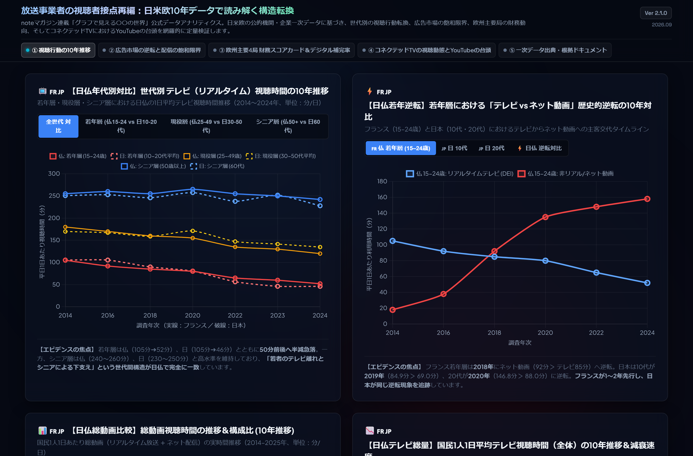
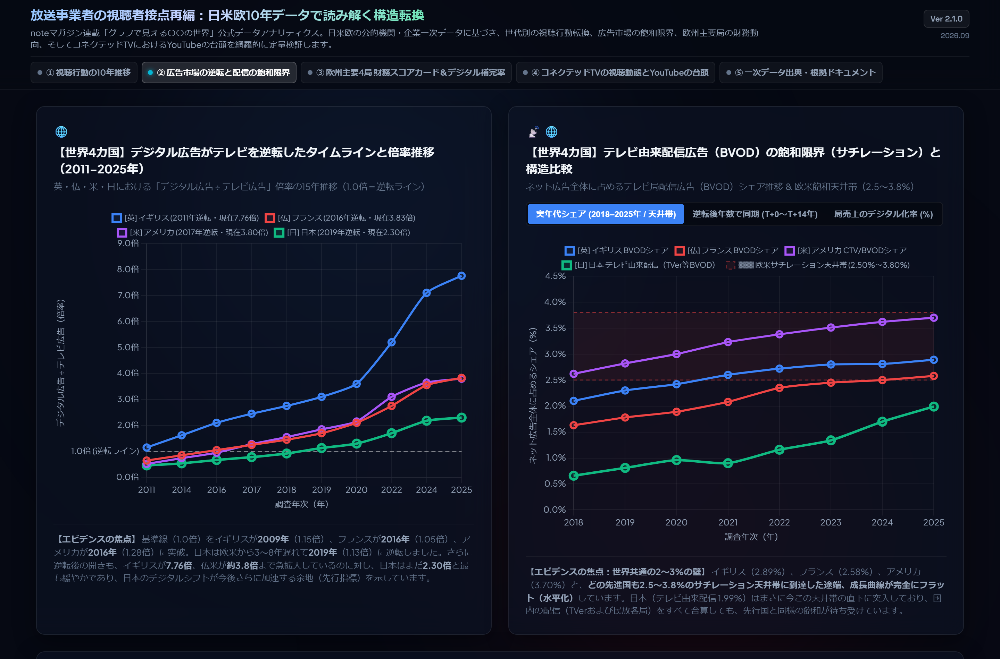
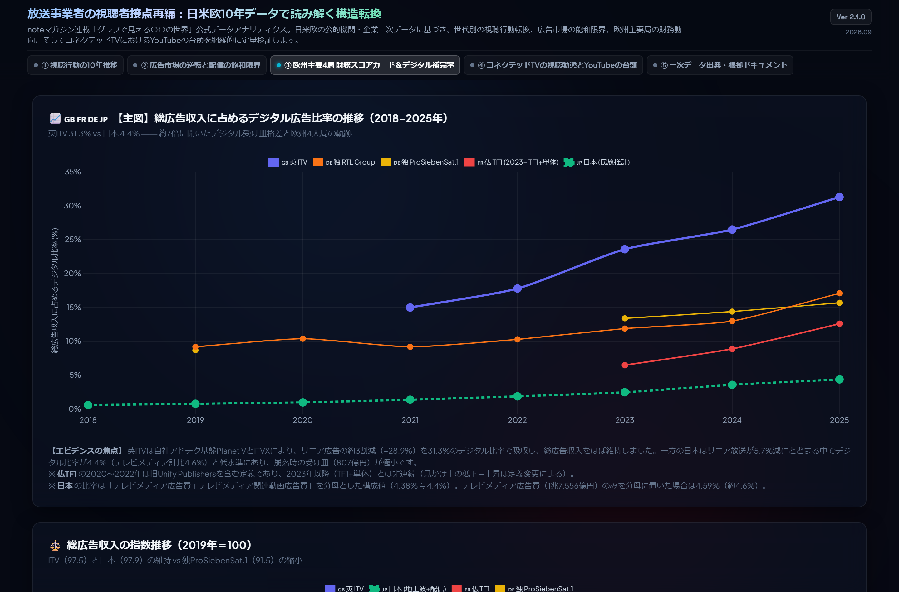
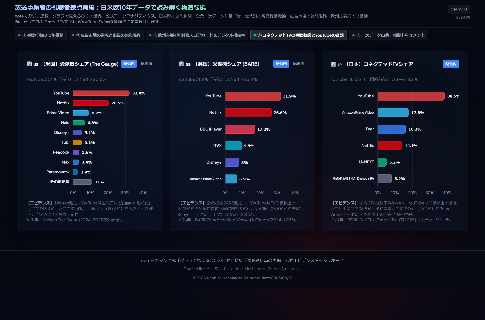

# Broadcaster Audience Shift Dashboard (放送事業者の視聴者接点再編)
### 10-Year Quantitative Evidence Across US, UK, France, Germany & Japan (2014–2025)

  
   
  <em>▲ クリックしてインタラクティブ・ダッシュボード（GitHub Pages）を全画面で体験 (Live Demo)</em>

---

放送事業者の視聴者接点再編 — 日米欧10年データで読み解く構造転換。  
noteマガジン連載「グラフで見える〇〇の世界」公式データアナリティクス。公的統計・企業一次データ（総務省、仏Médiamétrie、電通、Groupe TF1、英ITV plc、独ProSiebenSat.1、仏M6、英BARB、米Nielsen、REVISIO等）に基づき、日米欧の視聴行動転換、広告市場サチレーション、欧州主要4局の財務補完限界、コネクテッドTVにおけるYouTubeの台頭を網羅的に定量検証・可視化するオープンデータ・BIアナリティクスダッシュボードです。

---

## 🌐 Live Dashboard

* **Live Web Application**: [https://naohisastry.github.io/broadcaster-audience-shift-dashboard/](https://naohisastry.github.io/broadcaster-audience-shift-dashboard/)
* **Repository**: [https://github.com/naohisastry/broadcaster-audience-shift-dashboard](https://github.com/naohisastry/broadcaster-audience-shift-dashboard)

---

## 🔑 Keywords

broadcasters, linear-tv, streaming-wars, bvod, svod, youtube, connected-tv, nielsen-the-gauge, barb, revisio, dentsu, mediametrie, tf1, itv, prosiebensat1, m6, tver, data-visualization, financial-analytics, github-pages

---

## 🍱 Key Modules & Visual Analytics (全5タブ構成)

### 1. ① 視聴行動の10年推移（年代別・日仏比較）

* **世代別リアルタイム視聴時間推移 (2014–2024)**: 総務省情報通信メディア利用時間調査に基づく全年代（10代〜60代）の平日リアルタイムテレビ視聴時間推移。若年層（10代・20代）の57%急減とシニア層（60代）の維持トレンド。
* **テレビ vs ネット動画の歴史的逆転**: 10代（2019年逆転: 84.9分 vs 69.0分）および20代（2020年逆転: 146.8分 vs 88.0分）における主客交代の定量的タイムライン。
* **日仏総動画構成比対比**: フランス総動画（4時間14分中39%オンデマンド）と日本（3時間50分中25%オンデマンド）の構造直接対比。
* **フランスMédiamétrie DEI推移**: 国民1人1日あたりテレビ視聴時間の10年推移（220分➔192分）と日仏の視聴時間乖離の縮小実態。

---

### 2. ② 広告市場の逆転と配信の飽和限界（4カ国比較・国内BVOD）

* **4カ国広告逆転年次と倍率**: 英Ofcom/AA-WARC（2011年逆転・現在7.76倍）、仏SRI/UDECAM（2016年逆転・現在3.83倍）、米IAB/PwC（2017年逆転・現在4.27倍）、日電通（2019年逆転・現在2.30倍）の時系列追跡。
* **BVOD（放送局配信）シェアの天井定理**: 日米欧における放送局由来配信広告のネット広告市場シェア限界（3〜4%・約1,500億円の壁）。
* **TVer将来売上シミュレーション**: 2035年に向けたロジスティック普及曲線（S-Curve）とサチレーションモデル。地上波減収（年率数千億円）をTVer単独で補填することの数理的限界を証明。

---

### 3. ③ 欧州主要4局 財務スコアカード＆デジタル補完率（2019–2025）

* **欧州4大商業局の比較分析**: Groupe TF1（仏）、ITV plc（英）、ProSiebenSat.1 Media SE（独）、Métropole Télévision M6（仏）の一次決算開示に基づくセグメント比較。
* **デジタル売上比率の格差**: 英ITV（31.3%）、独ProSiebenSat.1（16.3%）、仏TF1（12.5%）、日本キー局平均（4.4%）。
* **デジタル補完率 (Digital Compensation Ratio)**: リニア放送減収に対するデジタル増収の補填力（ITV 81.3%、TF1 59.4%、M6 50.0%、ProSiebenSat.1 23.5%）。
* **純インパクト (Net Impact)**: 欧州最高峰のITVですら純減（-£60m）であり、4社全社においてリニア減収の絶対額がデジタル増収を上回るP/L水面下の実態。

---

### 4. ④ コネクテッドTVの視聴動態とYouTubeの台頭（日米欧受像機シェア）

* **日米英3カ国CTV比較**: 米Nielsen『The Gauge』、英BARB、日REVISIOの公的・第三者パネル調査の完全正規化。
* **同一スケール（横軸40%統一）＆物理描画長（207px）の幾何学的同期**: 3カードの棒グラフ描画エリアを物理ピクセル単位で1:1完全同期させ、グラフ間を横断したミリ単位の直接比較を実現。
* **YouTubeの大画面席巻**: 米国テレビ画面全体で13.4%（配信内32.4%）、英国動画共有で独走、日本CTV利用時間で38.5%とTVer（16.2%）の約2.4倍の規模で首位独走。

---

### 5. ⑤ 一次データ出典・根拠ドキュメント一覧
* 全グラフの基礎となった公的統計・IR開示資料の完全出典・URLリンク・算定根拠を完全網羅。

---

## 📊 Architecture & Design Standards

* **Zero-Dependency Single Page App**: 外部通信なしにオフラインでも完全自律動作するスタンドアロンHTMLアーキテクチャ。
* **金融端末基準のダークモードUI**: Bloomberg / FactSet 基準の高コントラスト配色、視認性を極限まで高めたタブ設計。
* **完全同期幾何学制御**: Chart.js の `afterFit` フックによるY軸140px固定制御、棒描画キャンバス（207px）の1:1ピクセル同期。

---

## 🛠️ File Structure

* `index.html`: ダッシュボード本体（完全自己完結型SPA / v2.1.0）
* `thumbnail.png`: リポジトリメインサムネール画像
* `social-preview.png`: OGP / SNS プレビュー画像
* `images/`: 各タブの解説サムネール画像
* `app.js`: Chart.js描画ロジック・インタラクション制御
* `data.js`: 確定一次エビデンスデータセット
* `styles.css`: プレミアム金融UIダークテーマ・スタイルシート
* `chart.min.js`: ローカル配備用 Chart.js ライブラリ
* `README.md`: プロジェクト概要・仕様書
* `METHODOLOGY.md`: 推計ロジック・数理モデル・幾何学制御仕様書
* `DATA_SOURCES.md`: 公的統計・IR資料の完全出典リンク集
* `CHANGELOG.md`: バージョン更新履歴
* `LICENSE`: MIT License
* `sitemap.xml`: SEOサイトマップ

---

## 🚀 How to Run Locally

任意のモダンブラウザ（Google Chrome, Microsoft Edge, Safari, Firefox）で `index.html` を直接ダブルクリックして開くだけでローカル動作します。

---

## 📄 License

This project is licensed under the MIT License - see the [LICENSE](LICENSE) file for details.
