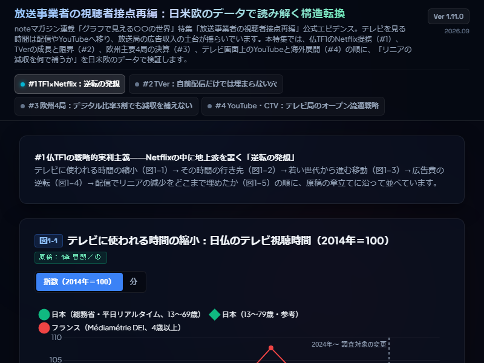

# Broadcaster Audience Shift Dashboard (放送事業者の視聴者接点再編)
### 10-Year Quantitative Evidence Across US, UK, France, Germany & Japan (2014–2025) Ver 1.10.0

  
   
  <em>▲ クリックしてインタラクティブ・ダッシュボード（GitHub Pages）を全画面で体験 (Live Demo)</em>

---

放送事業者の視聴者接点再編 — 日米欧のデータで読み解く構造転換。  
noteマガジン連載「グラフで見える〇〇の世界」公式エビデンスダッシュボード（校了・確定一次データ検証版）。公的統計・企業一次データ（総務省、仏Médiamétrie、電通、Groupe TF1、英ITV plc、独ProSiebenSat.1、仏M6、英BARB、米Nielsen等）に基づき、日米欧の視聴行動転換、配信広告の規模比較、欧州主要4局の財務データ、コネクテッドTVにおけるYouTubeの動向と海外展開を網羅的に定量検証・可視化するオープンデータ・BIアナリティクスダッシュボードです。

---

## 🌐 Live Dashboard

* **Live Web Application**: [https://naohisastry.github.io/broadcaster-audience-shift-dashboard/](https://naohisastry.github.io/broadcaster-audience-shift-dashboard/)
* **Repository**: [https://github.com/naohisastry/broadcaster-audience-shift-dashboard](https://github.com/naohisastry/broadcaster-audience-shift-dashboard)

---

## 🔑 Keywords

broadcasters, linear-tv, streaming, bvod, svod, youtube, connected-tv, nielsen-the-gauge, barb, dentsu, mediametrie, tf1, itv, prosiebensat1, m6, tver, data-visualization, financial-analytics, github-pages

---

## 🍱 Key Modules & Visual Analytics (全4タブ・19図版構成)

### 1. #1 TF1×Netflix：逆転の発想
* **図1-1: テレビに使われる時間の縮小**: 日仏テレビ視聴時間の10年推移（2014年＝100の指数および実数分）。
* **図1-2: 減ったテレビの時間はどこへ移ったか**: 総動画時間（リニア＋オンデマンド）の内訳推移。
* **図1-3: 若い世代から進む移動**: 世代別のテレビ・ネット動画利用時間推移と逆転年次。
* **図1-4: 広告費の逆転（2面構成）**: ネット広告費と地上波テレビ広告費の歴史的逆転年次・倍率推移。
* **図1-5: 配信でリニアの減少をどこまで埋めたか**: TF1における地上波減収とTF1+増収の対比。

---

### 2. #2 TVer：自前配信だけでは埋まらない穴
* **図2-1: TVerの利用規模と成長軌跡**: 月間再生数および月間ユニークブラウザ数（MUB）の推移。
* **図2-2: 地上波広告費とテレビ由来動画広告費の対比**: 電通データに基づく市場規模比較。
* **図2-3: ネット広告市場におけるテレビ由来動画広告の比率**: 総ネット広告費およびネットメディア広告費に対するシェア推移。
* **図2-4: 自前配信による将来補完シミュレーション**: 2035年に向けた地上波減収規模と配信増収シナリオの対比。

---

### 3. #3 欧州4局：デジタル比率3割でも減収を補えない
* **図3-1: 欧州4大商業局のデジタル広告売上比率**: 英ITV（31.3%）、独ProSiebenSat.1（16.3%）、仏TF1（12.5%）、仏M6（9.4%）と日本キー局平均の比較。
* **図3-2: 6年間の広告収入増減（リニア減 vs デジタル増）**: 各局のP/Lセグメント別増減実額。
* **図3-3: デジタル増収によるリニア減収の補完率**: リニア減収に対するデジタル増収の補填度（ITV 81.3%、TF1 59.4%等）。
* **図3-4: 純インパクト（Net Impact）の比較**: デジタル増収を足し合わせても4局すべてで総広告収入が純減となっている実態。

---

### 4. #4 YouTube・CTV：テレビ局のオープン流通戦略
* **図4-1: 米国テレビ画面におけるストリーミング各社のシェア**: Nielsen『The Gauge』に基づくYouTube・Netflix等のシェア。
* **図4-2: 英国テレビ画面における視聴シェア**: BARBデータに基づく放送局配信とYouTube等のシェア。
* **図4-3: コネクテッドTVの普及率推移**: 受像機のネット接続率推移。
* **図4-4: 主要動画プラットフォームのテレビ画面視聴比率**: YouTube等の大画面視聴シフト。
* **図4-5: 民放キー局の売上構成推移**: 地上波広告依存度とその他事業比率の推移。
* **図4-6: 放送コンテンツ海外輸出額の推移**: 番組販売・フォーマット輸出の規模推移。

---

## 📊 Architecture & Design Standards

* **Zero-Dependency Single Page App**: 外部CDNに依存せずローカル配置のChart.jsで動作するセキュアな設計。
* **金融端末基準のダークモードUI**: Bloomberg / FactSet 基準の高コントラスト配色、視認性を高めたレスポンシブタブ設計。
* **ファクトチェック済みの一次データ準拠**: 憶測や過大な断定を排除し、公的統計・IR開示資料で検証済みの客観的データセットのみを収録。

---

## 🛠️ File Structure

* `index.html`: ダッシュボード本体（完全自己完結型SPA / Ver 1.10.0）
* `data_v1100.js`: 一次データセット（検証・校了版）
* `app_v1100.js`: Chart.js描画ロジック・インタラクション制御
* `chart.min.js`: ローカル配備用 Chart.js ライブラリ (v4.5.1)
* `thumbnail.png`: リポジトリメインサムネール画像
* `social-preview.png`: OGP / SNS プレビュー画像
* `archive/v2.1.0/`: 旧バージョン保管ディレクトリ
* `README.md`: プロジェクト概要・仕様書
* `METHODOLOGY.md`: 推計ロジック・定義仕様書
* `DATA_SOURCES.md`: 公的統計・IR資料の完全出典リンク集
* `CHANGELOG.md`: バージョン更新履歴
* `LICENSE`: MIT License
* `LICENSE-CONTENT.md`: CC BY 4.0（文章・図表・整理済みデータ）

## 📄 License / ライセンス

- **Code**（HTML / CSS / JavaScript）: [MIT License](LICENSE)
- **Content**（文章・図表・分析結果・整理済みデータ）: [CC BY 4.0](LICENSE-CONTENT.md)
- 出典表示例 / Attribution: Naohisa Hashimoto, "broadcaster-audience-shift-dashboard", https://naohisastry.github.io/broadcaster-audience-shift-dashboard/
- 第三者の元データの権利は各発行元に帰属します。 / Third-party source data remain the property of their original publishers.

© 2026 Naohisa Hashimoto
